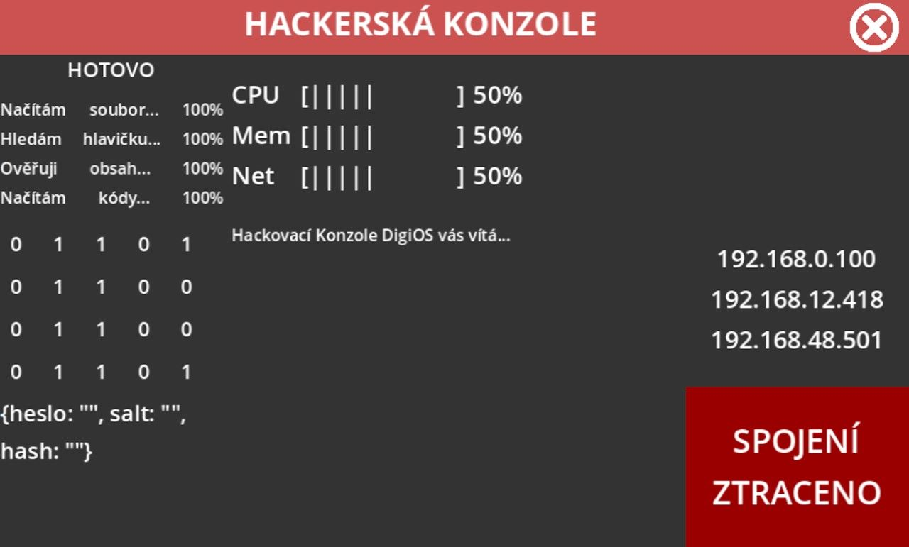

## ***Archived on 08/05/2024, the day it was released, as a done proof-of-concept prototype. There's no reason to continue the works on this project as it serves as a bare-bones OS for Godot for anyone interested to use.***

---

# DigiOS

*A proof of concept of an interactive OS made in Godot.*

[License](https://github.com/FTEdianiaK/digios/blob/main/LICENSE) | [Asset License](https://creativecommons.org/licenses/by-sa/4.0/)

### How to...

**Try out:**

- Grab the latest release [here](https://github.com/FTEdianiaK/digios/releases/latest).
- For more info, refer to the guide below.

**Re-code:**
- Grab a zip of the whole repository using the 'Code' button above.
- Alternatively, use 'git clone'.
- Open using [Godot](https://godotengine.org/).

### Guide

#### BIOS

- **ENTER** - changes loading mode (QCK/REG/FIR)
  - QCK - emergency load, desktop slowly catches up
  - REG - directly loads to fully loaded desktop
  - FIR - first start, checks all the system components
- **END** - switchs between AUT/MNL (for MNL, refer below)
- **F2** - brings up the bootloader changer (this also changes the theme color)

#### Notepad

- Simple text box.
- Saves its contents into the `notepad.txt` file in the user folder (`%appdata%/F_TEK/DigiOS`).

#### Database

- Very simple search based on `if` conditionals.
- Try typing `time boy` for start and see where that brings you.

#### Comms

- The caller's name can be changed by clicking on `[ENCRYPTED CALL]`.

#### Chat

- The chat room name can be changed by clickin on `CHAT ROOM`.
- Sending a message with a colon impersonates another chat user. (e.g. `TEST:HELLO` would result in a message `HELLO` sent by `TEST`)
  - Otherwise sends the message as sent by `ME`.

#### Hacker

- Mashing the buttons on your keyboard writes up a pseudo-code.

#### Pixel

- Clicking on his face changes his expression. There are 16 in total.

#### Emergency lockdown

- **Top Row** - Press in this order from left: 1, 5, 2, 4, 3.
- **Bottom Row** - Press both buttons.
- **Sliders** - Pull all of them up to the fullest.

#### Windowed mode

- To start the app in windowed mode instead of fullscreen, you need to create a `window.lock` file in the user folder (`%appdata%/F_TEK/DigiOS`).

#### MNL

- Allows you to move manually through the loading sequence using **PAGE UP** + **PAGE DOWN**.

### Known Bugs

- None yet... and none ever. This project has been archived as a basic proof-of-concept prototype. No updates will be made, this is just for anyone looking for a base for an OS in Godot.

### READ ME!

This project was originally planned to be used by the **XYZ KORPORACE** series by **STUDIO FILMU GO**. It has been dropped since. I've deleted most of the copyrighted material from the source code, but still treat the *written or other included information* within as fully copyrighted. Such as:

- the database banks (e.g. Molecule Girl + X-Stop are copyrighted)
- the logos in bootloaders
- etc. (copy the code, not the stuff)

### Credits

**Engine:** [Godot - by Godot Engine - MIT](https://godotengine.org/)

**Maps:** [OpenStreetMap - ODbL](https://www.openstreetmap.org)

**Icons:** [Game-icons.net - CC-BY](https://game-icons.net/)

**Fonts:**

- [FFF Forward - by Fonts For Flash](https://www.1001fonts.com/fff-forward-font.html)
- [Joystix Monospace - by Typodermic Fonts Inc.](https://www.1001fonts.com/joystix-font.html)
- [OpenSans - by Steve Matteson - Apache 2.0](https://www.1001fonts.com/open-sans-font.html)